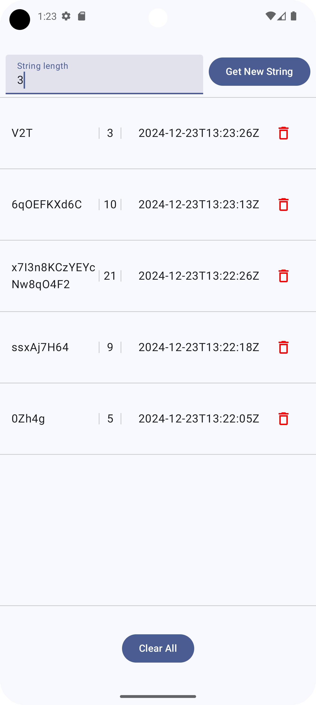
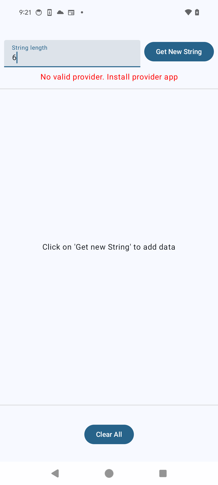
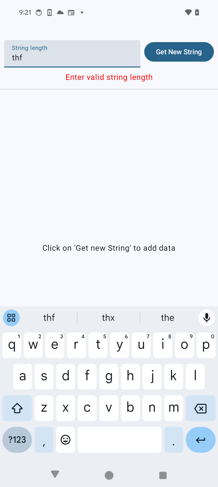

# Android Clean MVI Architecture Sample - String Reader App  

This repository demonstrates the implementation of a Clean Model-View-Intent (MVI) architecture in an Android application designed to read randomly generated strings from another application acting as a data provider. The architecture ensures separation of concerns, scalability, and maintainability through a layered approach.  

---

## Overview  

The application includes the following key features and technologies:  

- **Clean MVI Architecture**: Ensures separation of concerns and unidirectional data flow.  
- **Kotlin Coroutines**: For asynchronous and non-blocking programming.  
- **ViewModel**: Lifecycle-aware component for managing UI-related data.  
- **Jetpack Compose**: Modern UI toolkit for building native Android UIs.  
- **Dagger Hilt**: Dependency injection library for Android.
- **Room Database**: Local persistence to allow offline access to fetched strings and improve the app's usability.
- **Junit  and Mockk**: Writing unit tests using **MockK** to mock dependencies and validate logic.  

---

## Project Structure  

The project follows a modular architecture and is structured into the following packages:  

- **data**: Contains repositories, data sources, and models for handling data interactions.  
- **domain**: Contains use cases and domain-specific models for business logic.  
- **presentation**: Handles UI-related logic, including ViewModel, state management, Jetpack Compose components, and screens.  
- **di**: Manages the dependency injection setup using Dagger Hilt.  
- **util**: Utility classes and extensions for common operations.  

---

## Requirements  

The following requirements are covered in this implementation:  

- **AC-1**: The user can set the length of the string to be generated.  
- **AC-2**: The app queries the content provider for a random string with the specified length upon user interaction.  
- **AC-3**: Displays every generated string, including:  
  - The generated string  
  - The specified length of the string  
  - The time and date of creation  
- **AC-4**: Older strings remain visible to the user when a new string is generated.  
- **AC-5**: Users can delete all generated strings from the app.  
- **AC-6**: Users can delete a single generated string from the app.  
- **AC-7**: Error handling ensures a robust user experience.  

---

## Screenshots  

Here are some screenshots demonstrating the application:  
|Content|Error 1|Error2|
|-----|-----|-----|
||||

---

## Usage  

Upon launching the application:  

- The app will display a list of randomly generated strings fetched from the provider app.  
- Users can interact with the UI to refresh data, view string details, delete strings, and handle errors gracefully.  

---

## Author  

**Sumitkumar Dhule**  
